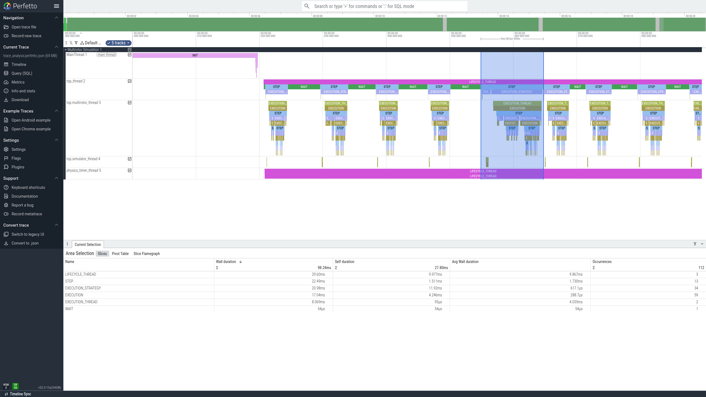

- [openformatproj/ml (Modeling Language)](#openformatprojml-modeling-language)
  - [Introduction](#introduction)
    - [`Part`](#part)
    - [`Execution`](#execution)
    - [`Port`](#port)
    - [`EventQueue`](#eventqueue)
    - [`Interface` \& `EventInterface`](#interface--eventinterface)
    - [`EventSource`](#eventsource)
    - [`Tracer`](#tracer)
  - [Dataflow Model](#dataflow-model)
    - [Asynchronous Dataflow (Events)](#asynchronous-dataflow-events)
    - [Synchronous Dataflow (Data)](#synchronous-dataflow-data)
  - [Execution Model](#execution-model)
    - [Core Concepts](#core-concepts)
    - [Description](#description)
    - [Example](#example)
  - [Execution Hierarchy and Threading Model](#execution-hierarchy-and-threading-model)
  - [Trace Analysis](#trace-analysis)
    - [Text Report](#text-report)
    - [JSON Report](#json-report)
      - [Perfetto UI Navigation Cheatsheet](#perfetto-ui-navigation-cheatsheet)
        - [Always Active](#always-active)
        - [On the Main Timeline Area](#on-the-main-timeline-area)
        - [On the Top Time-Scrubber Bar](#on-the-top-time-scrubber-bar)
  - [Execution Strategies \& Parallelism](#execution-strategies--parallelism)
  - [Scheduling Conditions](#scheduling-conditions)
  - [Standard Library Parts](#standard-library-parts)
    - [`EventToDataSynchronizer`](#eventtodatasynchronizer)
    - [`Operator`](#operator)
    - [`PID`](#pid)
    - [`Control_Element`](#control_element)
  - [Key Features](#key-features)
  - [Example: A Simple Simulation](#example-a-simple-simulation)
  - [Generating API Documentation](#generating-api-documentation)
  - [References](#references)
- [License](#license)

# openformatproj/ml (Modeling Language)

A lightweight, Python framework for building systems and running discrete-event and dataflow simulations. It is designed for creating complex, hierarchical systems where components communicate through well-defined interfaces.

## Introduction

The framework is built around a few key abstractions.

### `Part`
The fundamental building block of any system, and the owner of `Port`s and `EventQueue`s. A `Part` can be one of two types:

-   **Structural Part**: A container for other `Part`s. It defines the system's architecture by composing and connecting smaller components. It manages an execution loop that schedules its inner parts.
-   **Behavioral Part**: A component with a user-defined `behavior()` method. This is where the actual logic of the system (e.g., processing data, making decisions) resides.

### `Execution`
A callable object provided to a `Structural Part` that defines *how* a set of scheduled inner parts are executed.

The framework provides a `Execution` class that can be configured to handle purely sequential, purely parallel, or mixed workloads. For simple sequential execution, the `Execution.sequential()` factory method provides a convenient, pre-configured instance. For parallel execution, the `Execution` object can be configured to use either temporary threads or a persistent pool of worker processes, allowing for highly optimized performance.

The `Part` class is designed to delegate lifecycle management (spawning, termination) to these stateful strategy objects, creating a clean separation of concerns.

### `Port`
A `Port` is a synchronous, one-to-many data interface. It enforces a strict "write-once, read-once" data transfer policy. Data written to a master port is broadcast to all connected slave ports.

The connection establishes a **master/slave** relationship where the **master is the source of the data** and the **slave is the destination**. This relationship depends on the connection pattern:

-   **Peer-to-Peer**: An `OUT` port (master) connects to an `IN` port (slave).
-   **Downward (Parent-to-Child)**: A parent's `IN` port (master) connects to a child's `IN` port (slave).
-   **Upward (Child-to-Parent)**: A child's `OUT` port (master) connects to a parent's `OUT` port (slave).

A `Port` is primarily manipulated via two methods:
-   `set(payload)`: Used within a `behavior()` method to place a value on an `OUT` port.
-   `get()`: Used within a `behavior()` method to read a value from an `IN` port. The data is considered consumed for the current execution cycle; the framework automatically clears the port's `updated` flag after the `behavior()` method has finished, preventing the part from re-executing on the same stale data.

To ensure robust data flow, `Port`s will raise exceptions on improper use:
-   `Port.OverwriteError`: Raised if `set()` is called on a port that already has unconsumed data.
-   `Port.StaleReadError`: Raised if `get()` is called on a port whose data has already been consumed (or was never set).
-   `Port.PayloadError`: Raised if `set()` is called with a payload of incorrect type (when checks are enabled).

### `EventQueue`
An `EventQueue` is an asynchronous, buffered channel for passing event payloads between `Part`s.

It can be configured to operate in one of two modes:
-   **FIFO (default)**: The queue acts like a traditional queue. This mode is essential when every event must be processed in the order it was received, such as when simulating a system that must not drop any data from a real-world sensor.
-   **LIFO**: The queue acts like a stack. This is ideal for state-based simulations where only the most recent data is relevant (e.g., the latest sensor reading), as it naturally discards stale data during backpressure.
Like `Port`s, `EventQueue`s use a master/slave relationship for connections:
- **Source-to-Part**: An `EventSource`'s `OUT` queue (master) connects to a `Part`'s `IN` queue (slave).
- **Parent-to-Child**: A parent `Part`'s `IN` queue (master) can be routed to a child `Part`'s `IN` queue (slave).
### `Interface` & `EventInterface`
These are the internal "wires" of the framework, created automatically when you call `connect()` or `connect_event_queue()`. An `Interface` connects two `Port`s, and an `EventInterface` connects two `EventQueue`s. They are responsible for the actual data transfer logic.

### `EventSource`
An `EventSource` is a component that generates events from outside the main simulation loop. When its `start()` method is called, it launches its logic in a **new, dedicated thread**. The built-in `Timer` is a perfect example, emitting time events at a regular interval. Event sources are the primary way to drive a simulation.

Event transfers from a source to a part happen *immediately* in the `EventSource`'s thread when `emit()` is called. The behavior when the downstream `EventQueue` is full is controlled by the `on_full` parameter passed to the `EventSource`'s constructor (`FAIL`, `DROP`, or `OVERWRITE`), preventing the source from getting stuck while giving the user full control over the desired real-time behavior.
### `Tracer`
A centralized, thread-safe logging utility. It captures events from all components, sorts them by timestamp, and prints them in a clean, column-aligned format using fully-qualified component identifiers. This structured logging is invaluable for debugging the complex interactions in a multi-threaded simulation.

## Dataflow Model

The framework is built on a hybrid model that combines two distinct types of dataflow.

### Asynchronous Dataflow (Events)

This flow is used for time-decoupled communication, primarily to inject external stimuli into the simulation.

-   **Source**: It is driven by `EventSource` components (like `Timer`), which run in their own dedicated threads.
-   **Mechanism**: An `EventSource` calls `emit()`, which immediately attempts to push a payload into a connected `Part`'s `EventQueue` in the source's thread. This is how external events enter the simulation.
-   **Routing**: A structural `Part` can also route events between its own input queues and its children's queues. This transfer happens when the parent part either wakes up from an idle state or is executed as part of a larger dataflow chain.

This model is ideal for representing triggers, interrupts, and messages from the outside world that are not synchronized with the main simulation clock.

### Synchronous Dataflow (Data)

This is the primary mechanism for data processing within the simulation and occurs strictly within a structural part's `__step()` method.

-   **Source**: It is driven by `Part`s whose `behavior()` methods are executed.
-   **Mechanism**: A `behavior()` method reads data from `IN` ports and writes data to `OUT` ports.
-   **Propagation**: The data written to an `OUT` port is **not** immediately available to downstream parts. It is buffered until the current execution phase is complete. The parent part's `__step()` method then calls `_transfer_and_clear_ports()`, which copies the data from all `OUT` ports to their connected `IN` ports. This makes the data available for the *next* scheduling cycle.

This synchronous, step-based process is the key to the framework's determinism and robustness. It ensures that all calculations within a single simulation step are based on a consistent snapshot of the system's state. Because the outputs of a part's `behavior()` are buffered and only propagated after all scheduled parts have finished executing, the order in which independent parts are executed within a single step does not affect the outcome. This completely eliminates a whole class of tricky concurrency issues, such as race conditions, that are common in multi-threaded programming.

This mechanism is analogous to **non-blocking assignments** (e.g., `out <= in;`) in hardware description languages like VHDL or Verilog. In an HDL, all expressions on the right-hand side are evaluated using the values from the beginning of the current simulation delta cycle, and the assignments are scheduled to occur simultaneously at the end of the cycle. Similarly, in this framework, all `get()` calls within a step read from the same initial state, and the `_transfer_and_clear_ports()` function acts as the "clock edge" that commits all the buffered `set()` calls at once, preparing the state for the next step.

## Execution Model

### Core Concepts

The starting point is a structural, top-level part. When one or more of its inner parts are triggered by an event — typically a timer tick — they are scheduled for execution and the simulation begins. These stimulated parts initiate dataflow propagation by updating their outputs, which are connected to the inputs of neighboring parts. As these parts detect input updates, they are also scheduled for execution.

All structural parts scheduled for execution propagate the updated inputs down through the hierarchy until the bottom-level behavioral parts are reached. At that point, the behavioral logic executes, and the resulting output changes are propagated back up through the higher levels. Similar to event-driven simulations like VHDL, the dataflow continues until no further port updates remain, at which point the simulation remains idle until the next event.

### Description

A top-level **Structural Part** is designed to run a simulation loop. Calling its `start()` method launches its internal run loop in a **new, dedicated thread**. Each iteration of this loop performs the following operations:

1.  **Execute a Step**: The loop calls its internal `__step()` method. This method contains its own sub-loop that continues as long as there is data flowing between its children. Each sub-loop iteration involves:
    1.  **Scheduling**: It scans its direct inner parts. A part is scheduled for execution if its `scheduling_condition` is met. The default condition is to schedule a part if any of its `IN` ports have new data or any of its `IN` event queues are not empty.
    2.  **Execution**: The `execution_strategy` (e.g., `sequential_execution`) is called, which runs the `execute()` method on each scheduled part.
        -   **Behavioral Part `execute()`**: Calls the user-defined `behavior()` method.
        -   **Structural Part `execute()`**: Recursively runs the execution cycle for its own sub-system.
    3.  **Dataflow Propagation**: After the parts have been executed, `__step()` calls `_transfer_and_clear_ports()`. This is where the synchronous dataflow happens: the payload from all updated `OUT` ports is copied to their connected `IN` ports, making them ready for the next scheduling phase.

2.  **Check for Idle State**: After the `__step()` method completes, the loop checks if any parts were executed.
    -   **If Not Idle**: If parts were executed, it means the system is active, and the loop immediately proceeds to execute another `__step()`.
    -   **If Idle**: If no parts were scheduled, the system is considered idle. The main simulation thread will then pause by calling `__wait_for_events()`, waiting for an external `EventSource` (like a `Timer`) to provide a new event.

3.  **Wake Up**: When an event arrives, the loop wakes up, transfers the incoming events from its own input queues to its children's queues, and then returns to step 1 to execute a new `__step()`.

### Example
Imagine a simulation with a top-level structural part named `Top`. `Top` contains two children: a `Generator` and a `Processor`. The `Processor` is also a structural part, and it contains its own children, `Child_A` and `Child_B`. The data flows from the `Generator` to the `Processor`, which then routes it internally to `Child_A`, whose output then feeds `Child_B`.

The execution proceeds as follows:

1.  **Activation**: The `Generator` runs (perhaps driven by an external `EventSource`), producing data and placing it on the `Processor`'s input port.

2.  **Parent's Turn (`Top`)**: In its main execution loop, `Top` begins a `__step()`. It checks which of its direct children are ready to run. It sees that `Processor` has new input data, so it schedules `Processor` for execution. `Top` has no knowledge of `Child_A` or `Child_B`; it only manages its direct children.

3.  **Child's Turn (`Processor`)**: `Top` calls `execute()` on `Processor`. Now, `Processor` takes control and begins its own internal execution loop.

4.  **Internal Propagation**: The `Processor` first transfers the data from its own input port to `Child_A`'s input port. Then, its internal `__step()` loop runs:
    *   It sees `Child_A` is ready (its input port is updated) and executes it. `Child_A` processes the data and produces a new output for `Child_B`.
    *   The `Processor`'s `__step()` loop continues. It now sees `Child_B` is ready (its input port is updated) and executes it.
    *   The loop runs again. This time, no more children have new data. The internal system is idle, so the `Processor`'s internal `__step()` loop finishes.

5.  **Return Control**: The `Processor`'s `execute()` method completes, and control returns to `Top`.

This hierarchical delegation is the key to the framework's efficiency. `Top` only needed to activate `Processor` once. The entire internal chain reaction was handled by `Processor` itself. If a parent part is not scheduled, its `execute()` method is never called, and its entire sub-system remains dormant, saving computational resources.

## Execution Hierarchy and Threading Model

The framework's concurrency model is built on a clear hierarchy of threads and execution contexts. Understanding this hierarchy is key to interpreting trace logs and analyzing performance.

1.  **Lifecycle Threads (Highest Level)**: These are the long-lived, persistent threads that manage the entire lifecycle of a major component.
    -   **Creation**: A lifecycle thread is created when you call `start()` on a top-level `StructuralPart` or an `EventSource` (like a `Timer`).
    -   **Purpose**: This thread runs the component's main loop for the entire duration of the simulation. For a structural part, this loop is what repeatedly calls the `__step()` method.
    -   **Logging**: The lifetime of these threads is bracketed by `LIFECYCLE_THREAD_START` and `LIFECYCLE_THREAD_END` events in the trace log.

2.  **Execution Strategies**: A strategy is an orchestrator function that runs *within* its parent part's lifecycle thread.
    -   **Creation**: It is called by the parent's `__step()` method.
    -   **Purpose**: It receives a set of scheduled parts and decides *how* to run them (e.g., sequentially or in parallel).
    -   **Logging**: The duration of a strategy's orchestration is bracketed by `EXECUTION_STRATEGY_START` and `EXECUTION_STRATEGY_END` events.

3.  **Execution Contexts (Threads or Processes)**: This level represents the context in which a parallelized part is executed.
    -   **Creation**: Depends on the `Execution` strategy's `mode`:
        -   **`mode=ExecutionMode.THREAD`**: An ephemeral, short-lived `threading.Thread` is created for each part that a parallel strategy decides to run concurrently.
        -   **`mode=ExecutionMode.PROCESS`**: A persistent `multiprocessing.Process` is created once for each parallelized part when the simulation starts.
    -   **Purpose**: Its job is to run a single part's `execute()` method for one simulation step. Threads terminate after one step, while processes wait for the next command.
    -   **Logging**:
        -   In `thread` mode, the lifetime of the temporary thread is bracketed by `EXECUTION_THREAD_START` and `EXECUTION_THREAD_END`.
        -   In `process` mode, the lifetime of the persistent process is bracketed by `WORKER_PROCESS_START` and `WORKER_PROCESS_END`.

4.  **Single Executions (Lowest Level)**: This is the atomic unit of work in the simulation—the actual call to a part's `execute()` method.
    -   **Creation**: It is called either directly by a sequential strategy or from within an execution context (thread or process) by a parallel strategy.
    -   **Purpose**: It runs the part's core logic (its `behavior()` or its own inner `__step()` loop).
    -   **Logging**: The pure computation time of this unit of work is bracketed by `EXECUTION_START` and `EXECUTION_END` events.

By comparing the durations of `EXECUTION_THREAD` (in thread mode) and the inner `EXECUTION` logs, you can understand the time spent on thread management in your parallel strategies. In process mode, this comparison helps analyze the inter-process communication overhead.

## Trace Analysis

The structured logs produced by the `Tracer` can be parsed to generate detailed performance reports. This is invaluable for understanding performance bottlenecks, thread and processes management time, and verifying the real-time behavior of the simulation.

The `analyze_trace_log` function in `ml.tracer` can be called from a script to generate a report. For example, you could create a `create_report.py` script in your project's root:

```python
# create_report.py
import argparse
from ml.tracer import analyze_trace_log

if __name__ == "__main__":
    parser = argparse.ArgumentParser(description="Analyze trace logs.")
    parser.add_argument("log_file", help="Path to the trace log file.")
    parser.add_argument("--format", choices=['text', 'json', 'json:perfetto'], default='text', help="Output format.")
    parser.add_argument("-o", "--output", help="Path to the output file.")
    args = parser.parse_args()
    
    analyze_trace_log(log_path=args.log_file, output_format=args.format, output_file=args.output)
```

### Text Report

To generate a human-readable, hierarchical text report and save it to a file:
```sh
python create_report.py logs/trace.log --format text -o trace_analysis.log
```

This produces a hierarchical view of one or more complete simulation steps:

```
================================================================================
Performance Analysis of Simulation Step(s)
================================================================================
- top                          [INIT                    ] Duration:  150.123 ms Start Time: 10:00:00.000000 End Time: 10:00:00.150123
  - top.simulator                [INIT                    ] Duration:  100.050 ms Start Time: 10:00:00.050050 End Time: 10:00:00.150100
--------------------------------------------------------------------------------
- top                          [LIFECYCLE_THREAD        ] Duration:   10.005 ms Start Time: 10:00:00.150125 End Time: 10:00:00.160130
  - top                        [WAIT                    ] Duration:    3.001 ms Start Time: 10:00:00.150126 End Time: 10:00:00.153127
  - top                        [STEP                    ] Duration:    7.002 ms Start Time: 10:00:00.153127 End Time: 10:00:00.160129
    - top                      [EXECUTION_STRATEGY      ] Duration:    1.001 ms Start Time: 10:00:00.153127 End Time: 10:00:00.154128 (strategy: sequential_execution)
      - top.time_dist            [EXECUTION               ] Duration:    1.000 ms Start Time: 10:00:00.153127 End Time: 10:00:00.154127 Start Tick: 101 End Tick: 101
    - top                      [EXECUTION_STRATEGY      ] Duration:    6.000 ms Start Time: 10:00:00.154128 End Time: 10:00:00.160128 (strategy: parallel_toplevel_execution)
      - top.multirotor           [EXECUTION_THREAD        ] Duration:    5.001 ms Start Time: 10:00:00.154128 End Time: 10:00:00.159129
        - top.multirotor         [EXECUTION               ] Duration:    5.000 ms Start Time: 10:00:00.154128 End Time: 10:00:00.159128 Start Tick: 101 End Tick: 101
      - top.simulator            [EXECUTION_THREAD        ] Duration:    5.001 ms Start Time: 10:00:00.154128 End Time: 10:00:00.159129
        - top.simulator          [EXECUTION               ] Duration:    5.000 ms Start Time: 10:00:00.154128 End Time: 10:00:00.159128 Start Tick: 101 End Tick: 101
--------------------------------------------------------------------------------

```

In this report:

-   **`INIT`**: The one-time setup phase for a `Part`, triggered by calling its `init()` method. This is where initialization logic, such as setting up connections to external resources like a physics engine, is executed.
-   **`LIFECYCLE_THREAD`**: The total time the main thread of a `Part` (like `top`) was active for one full cycle.
-   **`WAIT`**: The idle time within that cycle, where the part's thread was sleeping, waiting for the next event. A healthy `WAIT` duration indicates the simulation is keeping up with its real-time schedule.
-   **`STEP`**: The "work" phase of a structural part's cycle. This is a loop that includes scheduling inner parts, calling the execution strategy, and propagating data between them. It continues as long as there is data flowing within the subsystem.
-   **`EXECUTION_STRATEGY`**: The time taken by the scheduler to orchestrate its children. The name of the strategy function (e.g., `sequential_execution`) is also shown.
-   **`EXECUTION_THREAD`**: The total lifetime of a temporary thread spawned by a parallel strategy.
-   **`EXECUTION`**: The pure computation time spent inside a single part's `execute()` method. For a behavioral part, this primarily measures its `behavior()` method. For a structural part, it measures the time to propagate its inputs and run its own internal `__step()` loop.

### JSON Report

To generate a machine-readable JSON report and save it to a file:
```sh
python create_report.py logs/trace.log --format json -o trace_analysis.json
```

This produces a structured JSON file, which is ideal for automated analysis or visualization.

It is also possible to generate reports for specific schemas, such as `json:perfetto`:
```sh
python create_report.py logs/trace.log --format json:perfetto -o trace_analysis:perfetto.json
```

This produces a structured JSON file that can be viewed by using the [Perfetto UI](https://ui.perfetto.dev). The only schema currently supported is `json:perfetto`.


<p align="center">Figure 1: An example of a simulation trace in the Perfetto UI. A jittery cycle (often caused by OS noise) results in a cascade of deadline misses.</p>

#### Perfetto UI Navigation Cheatsheet

##### Always Active
- **Pan Left/Right**: `A` / `D` keys
- **Zoom In/Out**: `W` / `S` keys

##### On the Main Timeline Area
- **Pan**: `Shift` + `Mouse Drag`
- **Zoom**: `Ctrl` + `Mouse Wheel`

##### On the Top Time-Scrubber Bar
- **Pan**: Click and drag the highlighted window.
- **Zoom**: Click and drag the left or right boundary of the highlighted window.

## Execution Strategies & Parallelism

The framework's execution model is highly efficient due to its hierarchical and data-driven nature. The core of this is the `Execution` strategy class, which orchestrates how a `Structural Part` runs its children.

When a structural part's `__step()` method runs, it calls its `Execution` strategy object, which performs the following:
1.  **Grouping**: It uses its `parallelization_condition` to separate all scheduled child parts into a **sequential group** and a **parallel group**.
2.  **Sequential Execution**: It immediately executes all parts in the sequential group, one by one, in the parent's thread.
3.  **Parallel Execution**: It then concurrently executes all parts in the parallel group.

This design enables straightforward and safe parallelism because the `execute()` methods of the scheduled parts are **completely independent of one another** for the current step. This independence is guaranteed by two key aspects of the dataflow model:

1.  **Pre-loaded Inputs**: All necessary input data has already been delivered to each part's `IN` ports before its `execute()` method is called.
2.  **Buffered Outputs**: When a part calls `set()` on an `OUT` port, the data is buffered locally within that port. It is **not** propagated to downstream parts until the parent's `__step()` method calls `_transfer_and_clear_ports()` *after* all scheduled parts have finished their execution.

This design ensures that the execution of one part cannot affect the inputs or state of another part within the same simulation step. The `Execution` strategy class leverages this to provide two modes for parallelism:

-   **`mode='thread'`**: For each part in the parallel group, a new, temporary `threading.Thread` is created to run its `execute()` method. This is lightweight and ideal for I/O-bound tasks or when the number of parallel parts is small.
-   **`mode=ExecutionMode.THREAD`**: For each part in the parallel group, a new, temporary `threading.Thread` is created to run its `execute()` method. This is lightweight and ideal for I/O-bound tasks or when the number of parallel parts is small.
-   **`mode=ExecutionMode.PROCESS`**: For each part in the parallel group, a persistent `multiprocessing.Process` is used. These worker processes are created once when the simulation starts and are reused for every step. This avoids the high overhead of process creation and is ideal for CPU-bound tasks that can benefit from true multi-core parallelism by bypassing Python's Global Interpreter Lock (GIL).

The framework guarantees data consistency at the boundaries of each `__step()`, making it trivial to leverage multi-core processors for high-performance simulations.

## Scheduling Conditions

A `SchedulingCondition` is a callable (function) provided to a `Part` that defines *if* it should be executed in the current simulation step. This provides fine-grained control over a part's execution, which is crucial for both correctness and efficiency.

If no custom condition is provided, the framework uses a default behavior: a part is scheduled if **any** of its `IN` ports have new data **or** if **any** of its `IN` event queues are not empty. This "OR" logic is suitable for many components that should react to any incoming stimulus.

However, custom scheduling conditions unlock more powerful and precise control. The most common use case is to enforce "AND" logic, ensuring a part only runs when **all** of its inputs are ready. This is critical for components like the built-in `Operator` part, which performs a mathematical operation and must not execute with incomplete or stale data.

For example, an `Operator` that adds two numbers should be defined with a condition like this:

```python
scheduling_condition=lambda part: part.get_port('in_0').is_updated() and part.get_port('in_1').is_updated()
```

This prevents the operator from running until both operands have arrived, guaranteeing correct behavior. Custom conditions also enable other advanced patterns, such as state-based or time-based scheduling, where a part's execution depends on its internal state or other external factors rather than just its inputs.

## Standard Library Parts

The framework includes a library of pre-built, reusable parts in `parts.py` to accelerate development.

### `EventToDataSynchronizer`
A generic behavioral part that synchronizes an asynchronous event to the synchronous dataflow domain. It consumes an event from an input `EventQueue`, extracts its payload, converts it using a specified type, and sets it on an output `Port`.

### `Operator`
A generic, stateless behavioral part that applies a user-defined function to its inputs. It waits for all of its input ports to receive new data, then calls the provided function.

### `PID`
A behavioral part implementing a standard PID (Proportional-Integral-Derivative) controller. It dynamically calculates the time step (`dt`) from a `time` input port, making it robust and easy to use.
Its gains (Kp, Ki, Kd) can also be updated dynamically via input ports, making it suitable for adaptive control systems.

### `Control_Element`
A structural part that composes a `PID` controller and an `Operator` to form a complete, standard control loop element. It takes `setpoint` and `measure` inputs and produces an `actuation` output, ready to be connected to a simulated plant.

## Key Features

-   **Hierarchical Composition & Execution**: Build complex systems by nesting `Part`s. The execution model is also hierarchical, ensuring that entire branches of the system are skipped if their parent part is not active, leading to high efficiency.
-   **Event-Driven & Dataflow Architecture**: Combines asynchronous event handling with synchronous data processing.
-   **Multi-Threaded by Design**: Clear separation between event-generating threads and the main simulation thread.
-   **Robust Exception Handling**: Exceptions in any `EventSource` or `Part` thread are caught, logged, and can be inspected, preventing the entire application from crashing.
-   **Powerful Structured Logging**: The `Tracer` provides deep insight into the simulation's behavior, making debugging easy.
-   **Configurable Log Levels**: Easily control the verbosity of framework and user logs from a central `conf.py` file.
-   **Lifecycle Management Hooks**: `Part`s support `init` and `term` hooks, allowing for clean setup and teardown of external resources like physics engines, network connections, or GUIs.
-   **Real-Time Simulation Support**: The `EventSource`'s `on_full` policy (`FAIL`, `DROP`, `OVERWRITE`) provides precise control over real-time behavior, enabling rigorous validation of performance requirements.
-   **Model Introspection and Serialization**: The hierarchical structure can be programmatically traversed via methods like `get_parts()` and `get_ports()`. This allows the entire model to be serialized (e.g., to JSON) for use with external tools, such as the [openformatproj/diagrams](https://github.com/openformatproj/diagrams) editor for automatic visualization and documentation.

## Example: A Simple Simulation

The `demo.py` file provides a clear example. Here's a simplified look at its structure.

**1. Define a Behavioral Part**

This part has one input port and logs the time value it receives.

```python
# Import dependencies and define constants

class Consumer(Part):
    """A simple behavioral part that consumes and prints a time value."""
    def __init__(self, identifier: str):
        ports = [Port('time_in', Port.IN)]
        super().__init__(identifier=identifier, ports=ports)

    def behavior(self):
        time.sleep(0.01)
        time_port = self.get_port('time_in')
        time_value = time_port.get()
        self.trace_log(CONSUMER_LOG_MSG, details={"time": f"{time_value:.3f}"})
```

**2. Define a Structural Part to Compose the System**

This part contains other parts and wires them together.

```python
class Simulation(Part):
    def __init__(self, identifier: str):
        event_queues = [EventQueue('main_time_q', EventQueue.IN, size=1)]
        parts = {
            'time_dist': EventToDataSynchronizer(
                'time_dist',
                input_queue_id='time_event_in',
                output_port_id='time_out',
                number_type=float
            ),
            'part_a': Consumer('part_a'), # A part that needs the time
            'part_b': Consumer('part_b')  # Another part that needs the time
        }
        super().__init__(
            identifier=identifier,
            parts=parts,
            event_queues=event_queues,
            execution_strategy=Execution.sequential()
        )
        distributor = self.get_part('time_dist')
        part_a = self.get_part('part_a')
        part_b = self.get_part('part_b')
        self.connect_event_queue(
            self.get_event_queue('main_time_q'),
            distributor.get_event_queue('time_event_in')
        )
        distributor_out_port = distributor.get_port('time_out')
        self.connect(distributor_out_port, part_a.get_port('time_in'))
        self.connect(distributor_out_port, part_b.get_port('time_in'))
```

**3. Run the Simulation**

The main block initializes the `Tracer`, the `Simulation`, and the `Timer`, connects them, and starts the threads.

```python
if __name__ == "__main__":

    Tracer.start(
        level=LogLevel.INFO,
        flush_interval_seconds=1.0,
        output_file=LOG_FILENAME,
        log_to_console=True,
        error_file="logs/simulation_errors.log"
    )
    Tracer.log(LogLevel.INFO, MAIN_COMPONENT_ID, LOG_EVENT_SETUP, {LOG_DETAIL_KEY_MESSAGE: MSG_CONFIGURING_SIM})

    sim = Simulation('my_sim')
    timer = Timer(
        identifier='main_timer',
        interval_seconds=0.001,
        duration_seconds=1,
        on_full=OnFullBehavior.DROP
    )

    sim.connect_event_source(timer, 'main_time_q')

    Tracer.log(LogLevel.INFO, MAIN_COMPONENT_ID, LOG_EVENT_RUN, {LOG_DETAIL_KEY_MESSAGE: MSG_STARTING_SIM_THREADS})
    sim.start(stop_condition=lambda _: timer.stop_event_is_set())
    timer.start()
    sim.wait()
```

## Generating API Documentation

The project is set up with Sphinx to generate professional API documentation from the code's docstrings.

1.  Install Sphinx: `pip install sphinx sphinx_rtd_theme`
2.  Navigate to the `docs/` directory.
3.  Run `make html`.
4.  Open `docs/build/html/index.html` in your browser.

## References

1.  [Perfetto UI official repository](https://github.com/google/perfetto)

# License


This project is licensed under the [Apache License 2.0](https://www.apache.org/licenses/LICENSE-2.0). You are free to use, modify, and distribute this software, provided that you include proper attribution to the original author(s). Redistribution must retain the original copyright notice and this license.